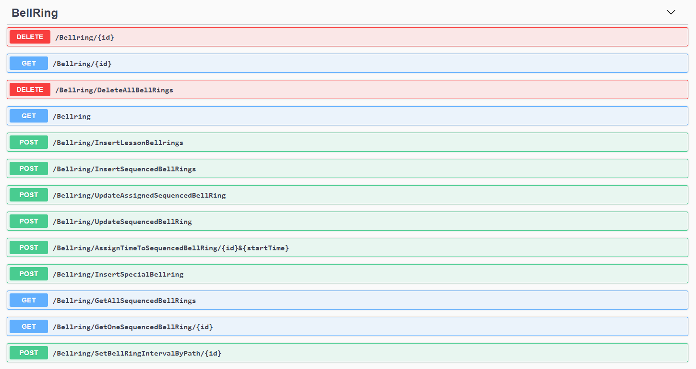
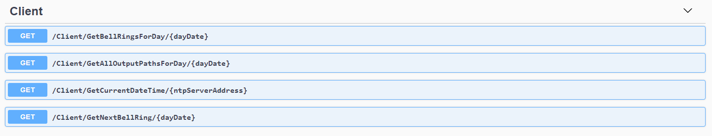
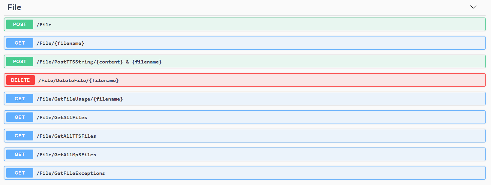
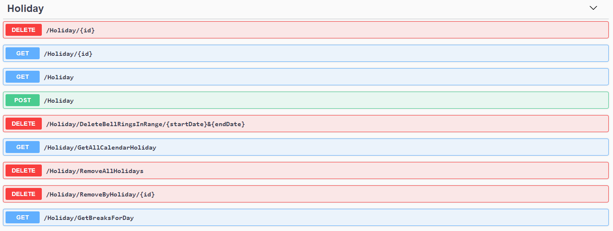
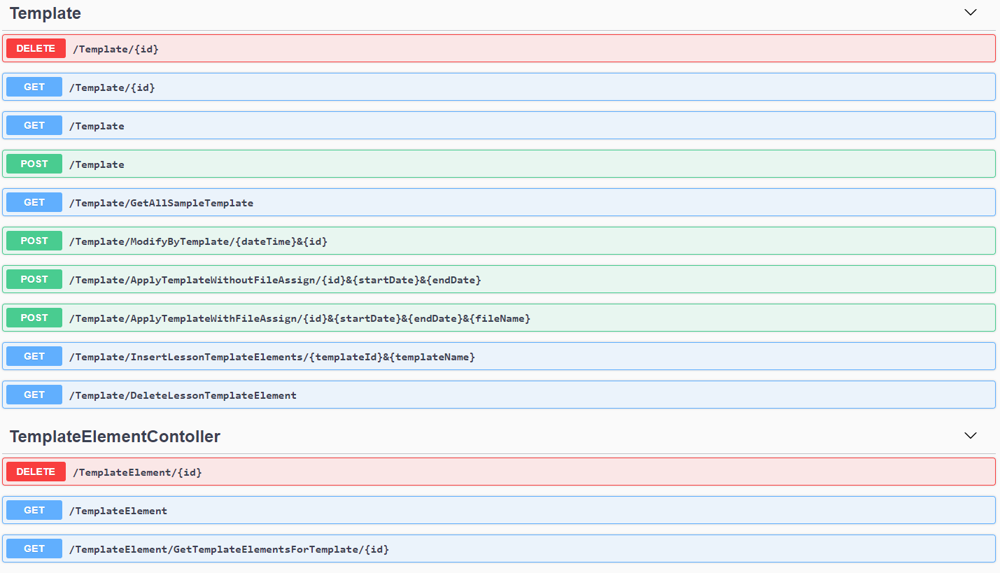
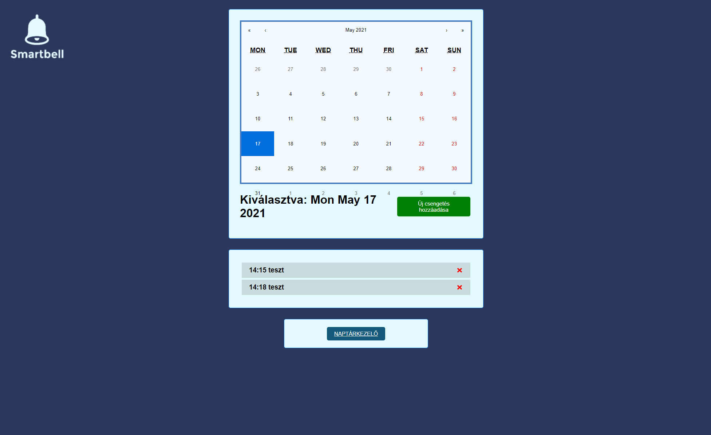
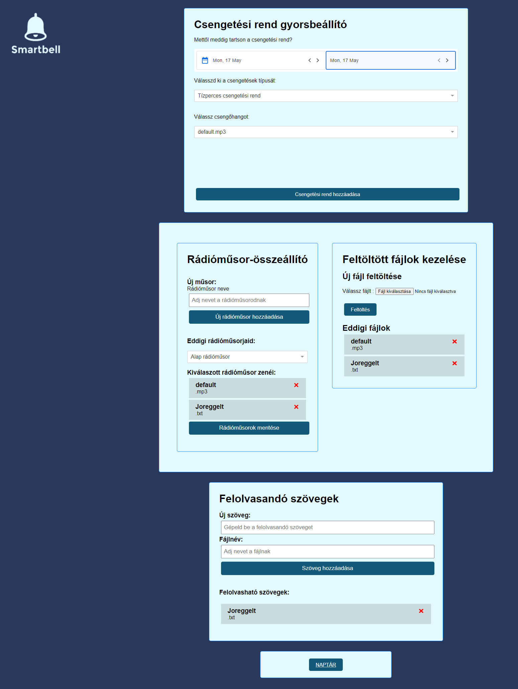

 
 

# Tartalomjegyzék: 

- [Projekt leírás](#projekt-leírás)
- [Használt technológiák](#használt-technológiák)
- [Csapattagok](#csapattagok)
- [Használati utasítás](#használati-utasítás)

# Projekt leírás
 
Jelenlegi projektben található meg egy iskoláknak szánt okoscsnegő alkalmazás. A projekt alapjául a backend szerver szolgál, ami az adatbázissal kommunikál. Készült egy asztali kliens ami egy API végponttal szinkronizál, hogy a csengetéseket futassa folyamatosan. Jelenleg a szoftver úgy van megírva, hogy egy gépen van futtatva a szerver, illetve a kliens is. Viszont az egész beállítását egy weboldal segíti, ami akár a belső hálozaton is elérhető. A weboldalunkon minden szükséges beállítás megtalálható, illetve csengetések rendszerezése és különböző csengő hangok feltöltése!
 

## Használt technológiák
 

* Backend: **ASP.net**
* Frontend: **REACT**
* Adatbázis: **Azure**
 

## Csapattagok:
 * Ács Péter - Backend
 * Bogya Roland - Backend
 * Tóth Áron - Frontend
 * Lencsés Dávid - Team Leader 

# Használati utasítás
 
 * Első sorban a szerver elindítása szükséges. Amint az felállt, lehet indítani a klienst illetve a weboldal is látogatható lesz onnantól kezdve! Egyelőre szükséges még a VS környezet a program futtatásához. 
 * A projekthez teljes leírást a <code>usermanual.pdf</code> fájlban talál.

## Elkészített API-k
 

### BellRing API-k
Itt találhatóak a csengetéssel kapcsolatos API-k
 

 

### Client API-k
Itt találhatóak a klienssel kapcsolatos API-k
 

 

### File API-k
Itt találhatóak a fájl kezeléssel kapcsolatos API-k
 

 

### Holiday API-k
Itt találhatóak a szünetekkel kapcsolatos API-k
 

 

### Template API-k
Itt találhatóak az előre beállított templatek. 
 

 

## Felhasználói felületek
 Főoldal
 Ez a felület tölt be először, itt tudjuk megtekinteni a különböző napokra beállított csengetéseket.
  
 
  
 Másodlagos oldal 
  
 
  

## Probléma dokumentáció
 

A fejlesztés során problémáinkat és ötleteinket egy online SCRUM boardban vezettük. Itt mindannyian hozzá tudtunk szólni, illetve a heti meetingen mindent átbeszéltünk ami kérdéses maradt.

Backend:
-  Sokat beszélgettünk az adatbázis felépítéséről, miket tároljunk a db-be milyen módon. Végül sikerült szerintem egy köztes megoldást találni.
-  Az Azure szolgáltatással volt nekünk többszöri problémánk. Először gyorsan leszívta a rendelkezésre álló kreditet, másodjára lejárt a próbaidőszak. Most éppen a harmadik opció fut, ami egy másik csapattag Azure-járól fut.
-  Problémánk akadt még az naudio nuget packet-tel. Mivel .net 5-s verzión készült a projekt, ezért ott már nem támogatott. Ezt tablib packet-re cseréltük.
-  TTS lejátszó implementálása, a szöveg felolvasást csak nehezen tudtok összerakni. Végül megoldódott. Speech synthetisizer és a registryből a magyar nyelv betöltése
-  Irdatlan mennyiségű merge confliktok debuggolása és kezelése.

Frontend:
- REACT és alapvetően a frontend felépítés a nulláról kezdése, így lassabb haladás volt csak vele. A minden backend funkcióra így sajnos nem készült el a frontend vagy csak félig.

